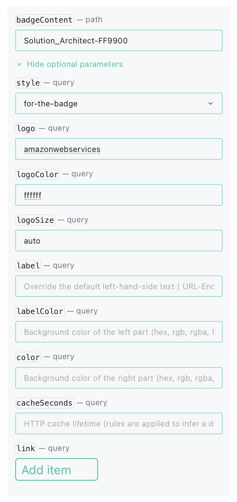

# Contributing to Certification Markdown Badges

Thank you for considering contributing to Certification Markdown Badges collection. We value your time and effort to maintain a healthy growing collection of Github badges of Certification for your GitHub profile, website, portfolio or any other online display.

## How to Add New Badges

You can add new badges of certifications to be listed in the repo by following below steps.

#### Step 1
Create a [fork](https://docs.github.com/en/get-started/quickstart/fork-a-repo) of this repository to your account.

#### Step 2
Update the needed file and add your badge by cloning to your local machine or directly editing the file in your repo.

Follow guidelines listed below to add new badge.

- Badge should be created with shields.io as a static badge.
- Add the badge to appropriate file. Files are created to segregate the badge categories. (Ex: Developer Certifications, DevSecOps, Project & Product Management)
- If the category is not listed as the files, feel free to create a new Category File.
- Icons should be used from [Simple Icons](https://simpleicons.org) and Badge Color should follow and represent the branding properly. (Ex: For AWS use #FF9900)
- Badges are ordered alphabetically, hence upon adding make sure the badge is added in the correct order.
- For certification name, try to use the shortened form as much as possible. In case you think submitting short and long format, feel free to submit both.
- Badge should follow below formatting. You can read more on the format in [Create Badge Guideline](#create-badge-guideline) below.

```

```

Example for AWS Certified Solution Architect
```

```

#### Step 3
Create a [pull request](https://docs.github.com/en/get-started/quickstart/contributing-to-projects#making-a-pull-request) with the proposed changes.

## Create Badge Guideline

This is the guideline to create a badge with Shield.io

### Color
The color of the badge should represent the branding correctly with **one color**. You can get these colors from branding guidelines or through [Simple Icons](https://simpleicons.org). 

### Logo
Logo should be picked from [Simple Icons](https://simpleicons.org). If the logo not available, you can contribute the Simple Icons repo to include the missing logo.

Logo sizing should be set to `auto`.

Below screenshot shows a sample setup in [shields.io badge creation screen](https://shields.io/badges/static-badge).


